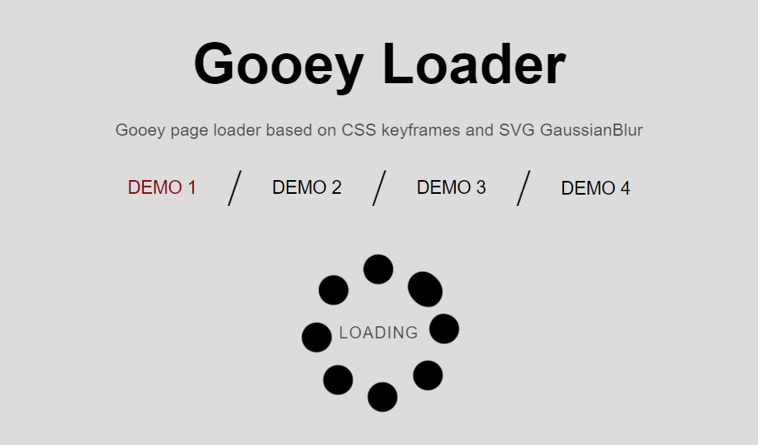

# Gooey Loader
Gooey page loader based on CSS keyframes and SVG GaussianBlur. [Demo Here](http://dicson.in/widgets/gooey-loader)

### Things to keep in mind
*	This is a CPU intensive effect. Keep in mind while you do Apply it for large areas & performing infinite animation
*	Refer [here](http://caniuse.com/#feat=css-filters) for browser support
* In firefox, The filter's url should be related to html document not to CSS file. To avoid collision, we used filter in internal stylesheet.

**Screenshot**

Developer by [@Dicson](http://dicson.in)

